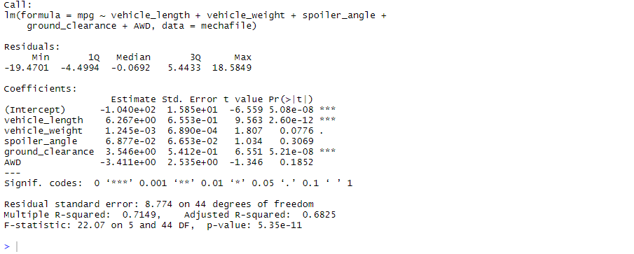
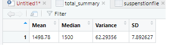
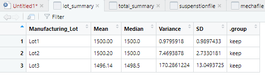
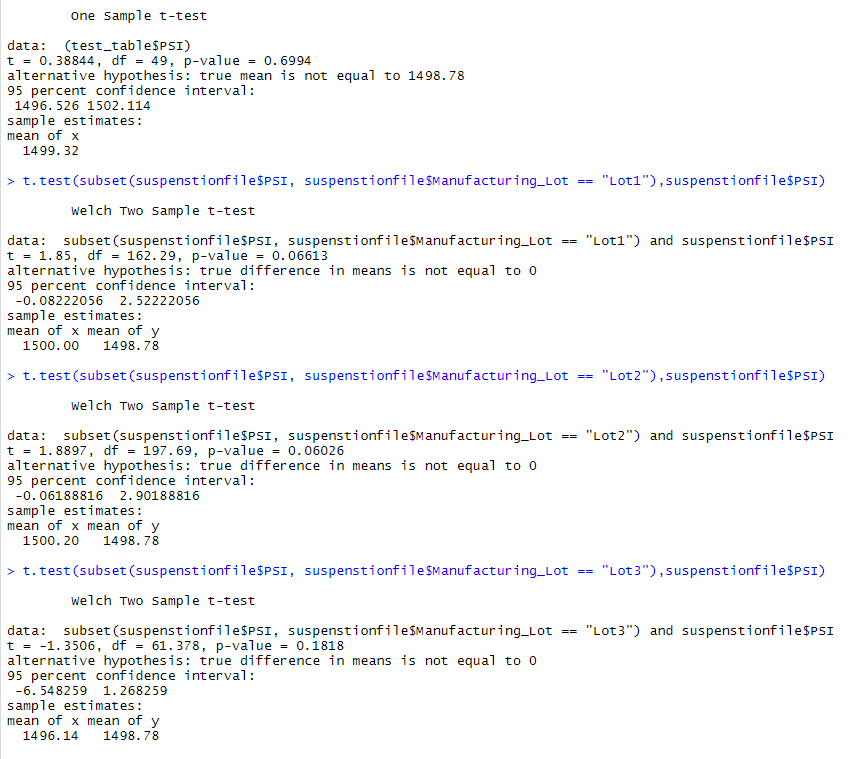

# MechaCar_Statistical_Analysis

## Overview
The purpose of this challnage is to: 
* Perform multiple linear regression analysis to identify which variables in the dataset predict the mpg of MechaCar prototypes
* Collect summary statistics on the pounds per square inch (PSI) of the suspension coils from the manufacturing lots
* Run t-tests to determine if the manufacturing lots are statistically different from the mean population
* Design a statistical study to compare vehicle performance of the MechaCar vehicles against vehicles from other manufacturers. For each statistical analysis, you’ll write a summary interpretation of the findings.

## Linear Regression to Predict MPG
 

* Which variables/coefficients provided a non-random amount of variance to the mpg values in the dataset?
    * looking at the p values (the last column) it shows that the vehical_length and groud_clearance have an impact on the mpg. They are the coefficents that provided a non-random amuount of varience.
* Is the slope of the linear model considered to be zero? Why or why not?
    * the slope is not zero as the p-value (shown on the bottom line) is less than significance level (shown on the line called Signif. codes)
* Does this linear model predict mpg of MechaCar prototypes effectively? Why or why not?
    * Yes, as shown in the second to last line titled Multiple R-squared the effectivity is 71%. Thus giving it a high effectivity rate.

## Summary Statistics on Suspension Coils
* The design specifications for the MechaCar suspension coils dictate that the variance of the suspension coils must not exceed 100 pounds per square inch. Does the current manufacturing data meet this design specification for all manufacturing lots in total and each lot individually? Why or why not?

 
Yes, the current manufacturing data does meet the design specification for all manufacturing lots in total, the total varience being 62.29. However, the current manufacturing data does not meet the design specification for all manufacturing lots individually. As shown in the images above for lot 1 and 2 the variance are 0.98 and 7.47 respectivly thus not exceeding the varience of 100lb per square in. However, for lot 2, the vbarience is 170.29.

## T-Tests on Suspension Coils
 
Assuming our significance level was the common 0.05 percent, the p-values for all three lots were above it. Thus showing that there is no reason to reject the null hypthisis, meaning the sample means of each lot is about the same a te population mean.

    